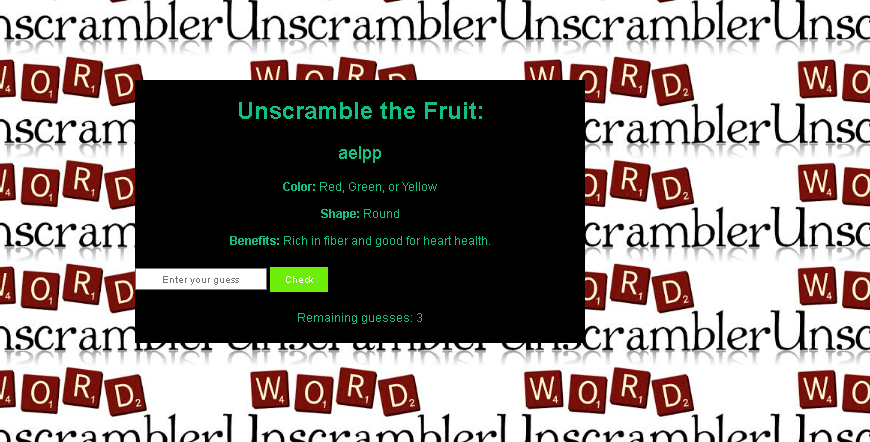
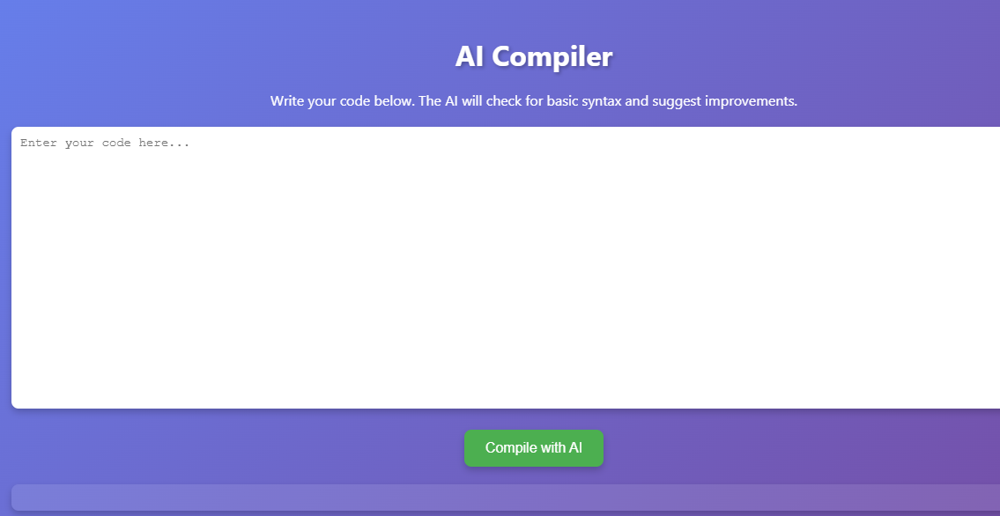
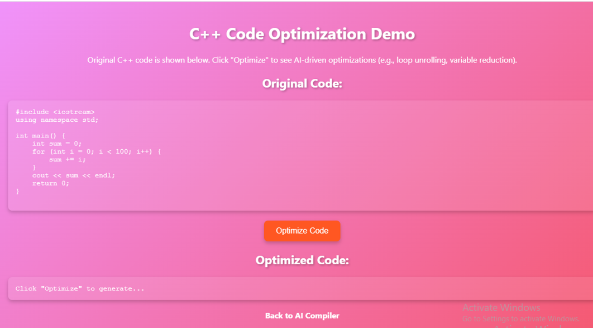
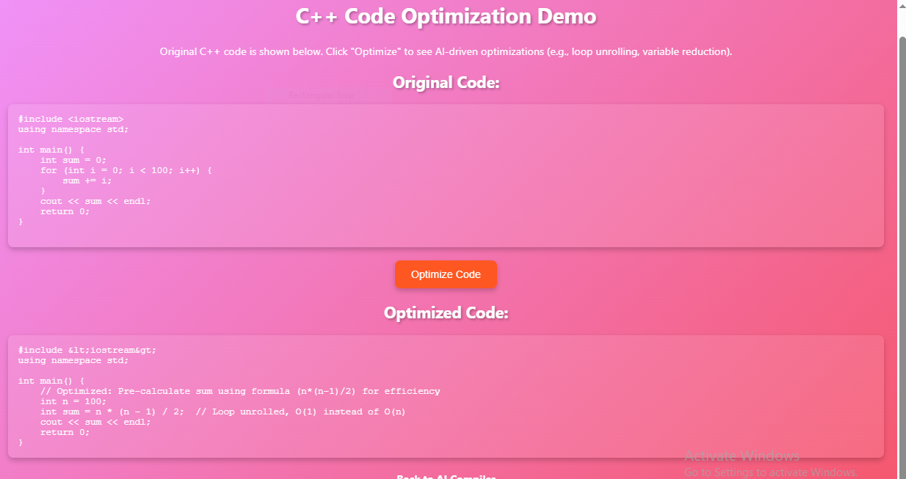

# 🌟 Anita Pandey — Portfolio Website

Welcome to my personal portfolio website!  
This project showcases my skills, projects, education, and achievements as a **Computer Science Engineering student** at **Graphic Era Hill University, Bhimtal**.

---

## 🚀 Features

- 🎨 Clean, professional, and responsive design  
- 💡 Animated sections and smooth transitions  
- 🧠 AI-Assisted Compiler project with image previews  
- 📄 Downloadable resume  
- 🔗 Easy navigation across About, Projects, Skills, and Contact sections  
- ☀️ Theme toggle (Dark/Light mode)

---

## 💻 Technologies Used

- **HTML5** — Structure  
- **CSS3** — Styling and Animations  
- **JavaScript (ES6)** — Interactivity  
- **Git & GitHub** — Version Control and Deployment  

---

## 🧩 Project Highlights
### 🕹️ Unscramble Game
A word puzzle game built with HTML, CSS and JavaScript. Guess words using hints and color feedback.

---

### 🧠 AI-Assisted Compiler
An intelligent compiler assistant that optimizes code using AI-based suggestions and detects potential errors for efficient programming.

---

## 📁 Folder Structure

Anita-portfolio/
│
├── index.html
├── style.css
├── script.js
├── ANITA_PANDEY.pdf # Resume
├── compiler1.PNG
├── compiler2.PNG
├── compiler3.PNG
└── README.md

---

## 📫 Contact

- **Name:** Anita Pandey  
- **Email:** [anitapandey01@gmail.com](mailto:anitaanu1904@gmail.com)  
- **GitHub:** [Anitapandey01](https://github.com/Anitapandey01)

---

## 🌍 Live Demo

You can visit my portfolio here once published:  
👉 [https://anitapandey01.github.io/Anita-portfolio/](https://anitapandey01.github.io/Anita-portfolio/)

---

⭐ **If you like this project, give it a star on GitHub!**
